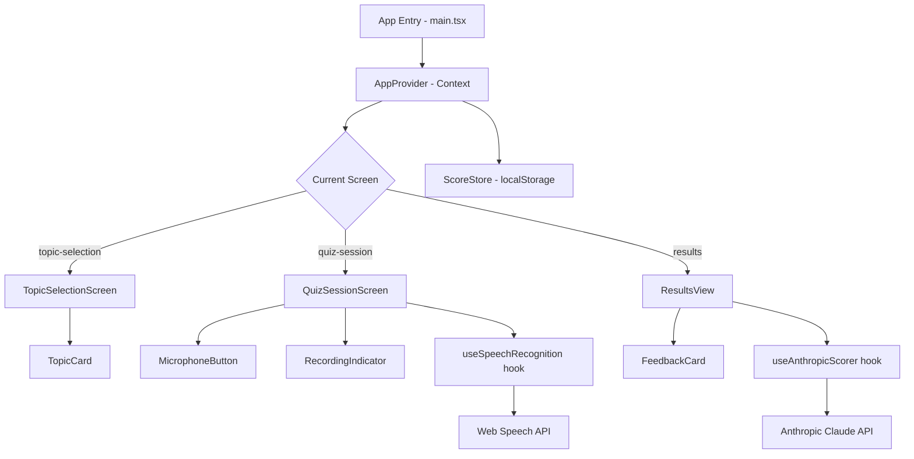

# Design Document: Interview Prep App

## Overview

A single-page React + TypeScript application that guides job seekers through interview practice. The app has three screens: Topic Selection, Quiz Session, and Results View. Users speak their answers via the Web Speech API, which transcribes them in real time. After completing a 3-question session, transcripts are sent to the Anthropic Claude API for scoring and feedback. Scores are persisted in localStorage so users can track progress across sessions.

The app is built with Vite, React 18, TypeScript, and Tailwind CSS. No backend is required — all logic runs in the browser, with the Anthropic API called directly from the client using a key stored in an environment variable.

---

## Architecture



The app uses a single React Context (`AppContext`) as the global state manager. Navigation is state-driven — no router library is needed. All side effects (speech recognition, API calls) are encapsulated in custom hooks.

---

## Components and Interfaces

### Screen Components

**TopicSelectionScreen**
- Renders topics grouped by category (Behavioral, Technical, Leadership)
- Reads scores from `ScoreStore` via context
- Calls `selectTopic(topic)` on card click

**QuizSessionScreen**
- Displays the current question (indexed from `AppState.currentQuestionIndex`)
- Hosts `MicrophoneButton` and `RecordingIndicator`
- Shows live interim transcript while recording
- Enables "Next" / "Finish" button only when a transcript exists for the current question
- On final question completion, triggers navigation to Results

**ResultsView**
- Displays overall score prominently
- Renders per-question feedback cards
- Saves score to `ScoreStore` on mount
- "Back to Topics" resets session state and navigates home

### Shared Components

**TopicCard** — displays topic name, description, question count, and optional previous score

**MicrophoneButton** — toggles recording state; visually distinct when active

**RecordingIndicator** — animated pulse shown while recording is active

**FeedbackCard** — displays question text, commentary, and improvement tips

### Custom Hooks

**`useSpeechRecognition()`**
```ts
interface UseSpeechRecognitionReturn {
  isRecording: boolean;
  transcript: string;       // final transcript after stop
  interimTranscript: string; // live text while recording
  startRecording: () => void;
  stopRecording: () => void;
  error: 'permission-denied' | 'not-supported' | null;
  retry: () => void;
}
```

**`useAnthropicScorer()`**
```ts
interface UseAnthropicScorerReturn {
  score: number | null;
  feedback: QuestionFeedback[];
  isLoading: boolean;
  error: string | null;
  submit: (transcripts: string[], questions: string[]) => Promise<void>;
  retry: () => void;
}
```

**`useScoreStore()`**
```ts
interface UseScoreStoreReturn {
  getScore: (topicId: string) => number | null;
  saveScore: (topicId: string, score: number) => void;
  allScores: Record<string, number>;
}
```

---

## Data Models

```ts
type Category = 'Behavioral' | 'Technical' | 'Leadership';

interface Topic {
  id: string;
  name: string;
  description: string;
  category: Category;
  questions: string[]; // at least 3 questions
}

interface QuestionFeedback {
  questionIndex: number;
  question: string;
  transcript: string;
  commentary: string;
  improvementTips: string;
}

interface ScoringResult {
  score: number;        // 0–10
  feedback: QuestionFeedback[];
}

type Screen = 'topic-selection' | 'quiz-session' | 'results';

interface AppState {
  screen: Screen;
  selectedTopic: Topic | null;
  currentQuestionIndex: number;  // 0–2
  transcripts: string[];         // indexed by question
  scoringResult: ScoringResult | null;
}
```

**Score_Store shape in localStorage:**
```ts
// Key: "interview-prep-scores"
// Value: JSON-serialized Record<topicId, number>
type ScoreStoreData = Record<string, number>;
```

**Anthropic API request shape:**
```ts
// Sent as a single user message with structured prompt
interface ScoringPrompt {
  topic: string;
  questions: string[];    // 3 questions
  transcripts: string[];  // 3 transcripts
}
// Response parsed from Claude's text output as JSON:
// { score: number, feedback: { commentary: string, improvementTips: string }[] }
```

---

## Correctness Properties

*A property is a characteristic or behavior that should hold true across all valid executions of a system — essentially, a formal statement about what the system should do. Properties serve as the bridge between human-readable specifications and machine-verifiable correctness guarantees.*


### Property 1: Topic grouping correctness

*For any* list of topics with assigned categories, the grouping function should place every topic under exactly its declared category heading, and every topic should appear in exactly one group.

**Validates: Requirements 1.2**

---

### Property 2: TopicCard renders all required fields

*For any* Topic object, the rendered TopicCard output should contain the topic name, description, and question count.

**Validates: Requirements 1.3**

---

### Property 3: TopicCard score display matches stored score

*For any* topic, if a score is present in the ScoreStore the rendered TopicCard should display that score; if no score is present, no score indicator should appear.

**Validates: Requirements 1.4, 1.5**

---

### Property 4: Quiz session never exceeds 3 questions

*For any* topic, the currentQuestionIndex in AppState should never advance beyond 2 during a quiz session, and advancing from index 0 or 1 should increment the index by exactly 1.

**Validates: Requirements 2.2, 2.8**

---

### Property 5: Next button enabled iff transcript exists

*For any* non-empty transcript string saved for the current question, the Next/Finish button should be enabled; for any empty or absent transcript, the button should be disabled.

**Validates: Requirements 2.7**

---

### Property 6: Interim transcript is displayed while recording

*For any* interim transcript string produced by the Web Speech API while a recording is active, that string should be visible in the QuizSessionScreen UI.

**Validates: Requirements 2.10**

---

### Property 7: All 3 transcripts are included in the scoring request

*For any* set of 3 transcripts collected during a quiz session, the payload sent to the Anthropic API should include all 3 transcripts without omission or modification.

**Validates: Requirements 4.1**

---

### Property 8: Parsed scoring result is structurally valid

*For any* well-formed response from the Anthropic API, the parsed ScoringResult should have a score satisfying 0 ≤ score ≤ 10 and a feedback array of exactly 3 items, each containing non-empty commentary and improvementTips fields.

**Validates: Requirements 4.2, 4.3**

---

### Property 9: Results_View renders complete scoring data

*For any* ScoringResult, the Results_View should render the overall score prominently and, for each of the 3 questions, display the question text, commentary, and improvement tips together in the same section.

**Validates: Requirements 5.1, 5.2, 5.3**

---

### Property 10: Score persistence round-trip

*For any* topic ID and score value, calling saveScore then getScore should return the same score value, and saving a new score for a topic that already has a stored score should replace the previous value.

**Validates: Requirements 5.4, 6.1, 6.2, 6.3**

---

### Property 11: Session state resets on back navigation

*For any* in-progress quiz session state (any selectedTopic, any currentQuestionIndex, any transcripts), navigating back to the Topic Selection screen should reset currentQuestionIndex to 0, transcripts to an empty array, and selectedTopic to null.

**Validates: Requirements 7.3**

---

## Error Handling

**Microphone / Speech Recognition errors**
- `permission-denied`: Show a user-facing message explaining microphone access is required, plus a Retry button that calls `retry()` on the hook (which re-invokes `getUserMedia`).
- `not-supported`: Show a message that the browser does not support speech recognition. No retry — the user must switch browsers.
- Both error states are surfaced via the `error` field on `useSpeechRecognition`.

**Anthropic API errors**
- Network failures, non-2xx responses, or malformed JSON in the Claude response all set `error` on `useAnthropicScorer`.
- The Results_View renders an error message and a Retry button that calls `retry()`, which re-submits the same transcripts.
- The API key is read from `import.meta.env.VITE_ANTHROPIC_API_KEY`; if missing, the hook should surface a clear configuration error rather than a cryptic 401.

**localStorage errors**
- `ScoreStore` wraps all `localStorage` calls in try/catch. On failure, scores degrade gracefully — the app continues to function, scores just won't persist.

**Malformed Claude response**
- If the Claude response cannot be parsed as the expected JSON shape, `useAnthropicScorer` sets an error state rather than crashing. The user can retry.

---

## Testing Strategy

### Unit Tests (example-based)

Focus on specific interactions and edge cases:

- `AppContext`: initial state is `topic-selection` screen; `selectTopic` transitions to `quiz-session`; back navigation resets session data; advancing from question 2 transitions to `results`.
- `useSpeechRecognition`: permission-denied error state; not-supported error state; transcript saved on stop.
- `useAnthropicScorer`: loading state while request is in flight; error state on API failure; retry re-submits transcripts.
- `useScoreStore`: returns null for unknown topic; overwrites existing score.
- `TopicCard`: renders score when present; renders no score indicator when absent.
- `QuizSessionScreen`: Next button disabled without transcript; enabled with transcript.
- `ResultsView`: loading indicator shown while scoring; error + retry shown on failure.

### Property-Based Tests

Use **fast-check** (TypeScript PBT library) with a minimum of **100 iterations per property**.

Each test is tagged with:
`// Feature: interview-prep-app, Property <N>: <property_text>`

Properties to implement:

| Property | Test target | What varies |
|---|---|---|
| 1 — Topic grouping correctness | `groupTopicsByCategory()` pure function | Random topic arrays with mixed categories |
| 2 — TopicCard renders all required fields | `TopicCard` render | Random Topic objects |
| 3 — TopicCard score display matches stored score | `TopicCard` render | Random topics with/without scores |
| 4 — Quiz session never exceeds 3 questions | `AppContext` state transitions | Random sequences of advance actions |
| 5 — Next button enabled iff transcript exists | `QuizSessionScreen` render | Random transcript strings (empty vs non-empty) |
| 6 — Interim transcript displayed while recording | `QuizSessionScreen` render | Random interim transcript strings |
| 7 — All 3 transcripts included in scoring request | `useAnthropicScorer` / request builder | Random transcript content |
| 8 — Parsed scoring result is structurally valid | Response parser function | Random valid Claude response shapes |
| 9 — Results_View renders complete scoring data | `ResultsView` render | Random ScoringResult objects |
| 10 — Score persistence round-trip | `useScoreStore` / `ScoreStore` | Random topic IDs and score values |
| 11 — Session state resets on back navigation | `AppContext` state transitions | Random in-progress session states |

### Integration Tests

- End-to-end flow with mocked Web Speech API and mocked Anthropic API: select topic → answer 3 questions → view results → verify score persisted → return to topics → verify score shown on card.
- Verify `VITE_ANTHROPIC_API_KEY` is read from environment (smoke test).
